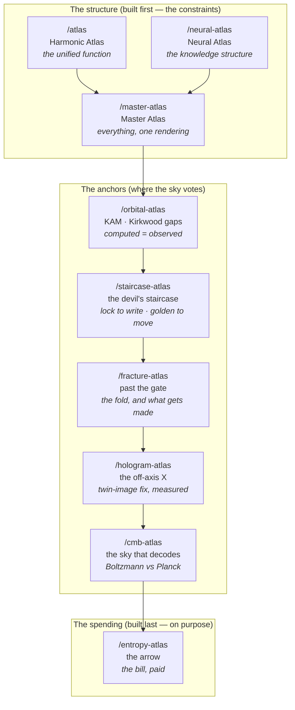

# The Atlas — The Complete Record

_The definitive document of the Harmonic / Neural Atlas build: every page, every
generator, every number, every claim with its ledger status, and how to
regenerate all of it from this repository alone. Written so that nothing depends
on any conversation thread surviving. If you are reading this with no other
context: everything below is checkable from the files named beside it._

Co-authored by Stewart Barteau and Claude, July 2026. Stewart supplied the
seeing — the geometry, the intuitions aimed across scales, the standing order to
push back rather than please. Claude supplied the math, the code, and the audit
discipline. The rule the whole thing runs on: **nothing is claimed that cannot
be stood behind, and every claim is labeled with what kind of standing it has.**

---

## 1. The map



| Page               | What it shows                                                                                                                                                                                                                                         | Generator                                | Snapshot                                  |
| ------------------ | ----------------------------------------------------------------------------------------------------------------------------------------------------------------------------------------------------------------------------------------------------- | ---------------------------------------- | ----------------------------------------- |
| `/atlas`           | The unified function: 21 pillars, 19 lobes/flower, hubless bridge fabric, φ-ellipse vessel with its conjugate-pair molecule                                                                                                                           | `scripts/generate-harmonic-snapshot.mjs` | `src/data/harmonic-snapshot.json`         |
| `/neural-atlas`    | The knowledge neural structure: pole singularities, φ² toroid spirals, 1·3·5·**7**·5·3·1 = 25 stations with a shared equator lock, lemniscate lobes, Flower of Life, jitterbug 12+1→13, quantum belt (spin-½), far-field spin, golden split           | `scripts/generate-neural-snapshot.py`    | `src/data/neural-structure-snapshot.json` |
| `/master-atlas`    | Both structures nested in one scene; Combined / Unified / Neural selector; every layer toggleable                                                                                                                                                     | (reads both snapshots)                   | —                                         |
| `/orbital-atlas`   | The KAM anchor: standard-map survival landscape → Kepler → the observed Kirkwood gaps                                                                                                                                                                 | `scripts/generate-orbital-snapshot.py`   | `src/data/orbital-snapshot.json`          |
| `/hologram-atlas`  | The off-axis cross (the X): two beams cross at a rotating knot; the crossing angle carries the twin image away — Leith–Upatnieks off-axis holography, twin-image fix measured (recovery 0.24→1.00)                                                    | `scripts/generate-hologram-snapshot.py`  | `src/data/hologram-snapshot.json`         |
| `/staircase-atlas` | The devil's staircase (the bridge): mode-locked treads at every rational — the clamp writing requires ("stay there and circle") — Fibonacci treads shrinking ~3× toward golden, and the golden thread still unlocked at critical coupling             | `scripts/generate-circlemap-snapshot.py` | `src/data/circlemap-snapshot.json`        |
| `/fracture-atlas`  | Past the gate: the fold (min f′ = 1−K, forced), the rotation interval opening ×22, chaos only past K=1, the golden route captured by 13/21 then the mediants, overlap + hysteresis, and a ring where topological charge changes only in integer jumps | `scripts/generate-fracture-snapshot.py`  | `src/data/fracture-snapshot.json`         |
| `/cmb-atlas`       | The CMB as a decoded cross-section: CAMB-computed acoustic spectrum vs Planck's measured peaks; a drawn sky; the spectrum recovered from that sky alone                                                                                               | `scripts/generate-cmb-snapshot.py`       | `src/data/cmb-snapshot.json`              |
| `/entropy-atlas`   | The arrow: a Loschmidt echo (exact reversal unmixes; 10⁻⁶ perturbation kills the return), the foil rendered, the regulator's ledger with S first-class                                                                                                | `scripts/generate-entropy-snapshot.py`   | `src/data/entropy-snapshot.json`          |

**The discipline every page obeys:** one source of truth, locked. A committed
generator computes a snapshot; the renderer draws it verbatim and re-derives
nothing. Presentation choices (scene scales, sampling densities, drawn edge
lists) are labeled as presentation _inside the generators and snapshots
themselves_. Foils — control experiments built to fail — back every survival
claim.

**The on-ramp.** `/master-atlas` carries a **Guided tour** ("Let Elle walk you
through it"): a scripted, deterministic walkthrough in Elle's voice that reveals
one level at a time — singularity → spiral → tuples → halos → the equator lock →
flower → pillars/bridges → vessel → break → belt → golden split → the whole —
gliding the camera to each while the locked snapshot keeps winding. It ends by
opening the two real doors: talk to Elle (`/elle`) and read this record. The
tour is the hallway between the widget (overwhelming cold) and the papers (deep
for the already-convinced); live-Elle-driven guidance is the intended sequel.

## 2. Regenerating everything

```bash
# no extra dependencies
node   scripts/generate-harmonic-snapshot.mjs        # --check verifies committed snapshot
python3 scripts/generate-neural-snapshot.py

# requires numpy (pip install numpy)
python3 scripts/generate-orbital-snapshot.py         # ~16 s: standard-map sweep
python3 scripts/generate-hologram-snapshot.py        # exact interference + reconstruction
python3 scripts/generate-circlemap-snapshot.py       # ~30 s: devil's staircase + tongue fan (also reads the hologram snapshot)
python3 scripts/generate-fracture-snapshot.py        # ~4 min: past the gate (reads the circlemap snapshot's golden dial)
python3 scripts/generate-entropy-snapshot.py         # ~13 s: event-driven Loschmidt echo

# requires numpy + camb (pip install camb)
python3 scripts/generate-cmb-snapshot.py             # ~3 s: Boltzmann solver

npx prettier --write src/data/*.json                 # repo formatting
npm run check:astro && npm run build                 # verify the site
```

All generators are deterministic: same inputs, same bytes (modulo prettier
formatting, which `generate-harmonic-snapshot.mjs --check` ignores by comparing
parsed content).

## 3. The certificates — every number, checkable

### 3.1 Harmonic (the wiring pass, PR #63)

The snapshot's meta claims derivation from `elle-worker/src` (scaffold,
regulator, phase-vessel, cognitive-obliquity — blob SHAs in the generator
header). The pressure test found one module wired, one run-but-unrecorded, one
dead, one decorative; the committed generator made all four true:

| Quantity                         | Value                                       | Standing                                                                                                                                                               |
| -------------------------------- | ------------------------------------------- | ---------------------------------------------------------------------------------------------------------------------------------------------------------------------- |
| Fabric edges                     | 42, from `egalitarianFabric(21, 4, 0.3, 7)` | **bit-for-bit reproduced**                                                                                                                                             |
| degree_gini / betweenness_spread | 0.146 / 3.477                               | exact reproduction (fabric-only metric; the audit's 0.138 was the audit's own error)                                                                                   |
| Coherence triple                 | (0.99995…, 0.99993…, 0.99991…)              | live `regulate()` output, inputs recorded; the _old_ stored triple sat on the regulator's slow eigenvector to 4 decimals — a real run whose inputs were never recorded |
| Free energy F                    | 0.000000                                    | converged in 104 steps                                                                                                                                                 |
| Area invariant                   | 1.000000018                                 | **measured** conservation-under-evolution (600 symplectic steps from an off-orbit start, lock at step 296) — replacing the x·1/x tautology the audit retired           |
| snapshotAngleRad                 | 5.1547 (θ = 0.8204)                         | `hold()`'s actual final phase, with certificates                                                                                                                       |
| Obliquity θ                      | 38.669°                                     | derived: golden crossing of the _measured_ cos²θ curve (analytic ideal 38.173°); replaced the chosen 26.0495°                                                          |

### 3.2 Neural (the counts, and the golden split)

| Quantity                                     | Value                                                             | Standing                                                                                                                                     |
| -------------------------------------------- | ----------------------------------------------------------------- | -------------------------------------------------------------------------------------------------------------------------------------------- |
| Stack                                        | 1·3·5·7·5·3·1 = 25 = 5²                                           | forced arithmetic on chosen inputs (stated)                                                                                                  |
| 21 = 5×4+core; 19 = 1+6+12; 13 = 12-around-1 | —                                                                 | forced; 19 and 13 are packing facts, **not** φ                                                                                               |
| Spiral turns                                 | φ²                                                                | computed from φ                                                                                                                              |
| Golden split                                 | φ⁻¹ / φ⁻² = 0.618 / 0.382, toward the core-displacement pole (+y) | **prediction, not measurement** — the only self-similar unequal partition (φ⁻¹+φ⁻²=1); pre-break the mirror symmetry forces equal & opposite |
| Belt parity                                  | windings 1,2,3,5,8 → 3 odd : 2 even (weight 9:10)                 | forced — a Fibonacci belt cannot split evenly                                                                                                |

### 3.3 Orbital — the KAM anchor (PR #63)

| Quantity             | Computed                | Observed                      | Note                                                                       |
| -------------------- | ----------------------- | ----------------------------- | -------------------------------------------------------------------------- |
| 3:1 gap              | 2.5020 AU               | 2.502 AU                      | `a = a_J·(q/p)^⅔`, zero free parameters                                    |
| 5:2 gap              | 2.8254 AU               | 2.825 AU                      |                                                                            |
| 7:3 gap              | 2.9584 AU               | 2.958 AU                      |                                                                            |
| 2:1 gap              | 3.2786 AU               | 3.279 AU                      |                                                                            |
| Golden torus breakup | 1.059 (transport proxy) | K_c = 0.971635 (Greene, lit.) | proxy overshoots, stated; conjugacy check 1−1/φ: 1.037 (~2% error, stored) |

Dip ordering measured: 1/2 dies first (K=0.44), then 1/4, 1/3 ≈ 3/7, 2/5 — and
the golden winding tops the landscape. The rendered belt's density is carved by
the computed curve; gap _centers_ land on the data, gap _widths_ inherit the
proxy's band and are stated as wider than the real belt's. The golden winding
lies **outside** the belt's winding window (0.249–0.5515) — no claim that any
rock sits at a golden ratio.

### 3.4 Holographic — the off-axis cross, the X (PR #64, rebuilt)

Stewart's correction: the two halves don't project straight out and record
inline — they **separate, angle toward each other, and cross in an X**,
reflecting off the central rotating knot, and that is what writes the hologram.
This is a real physics upgrade: **Gabor inline (1948) → Leith–Upatnieks off-axis
(1962)**, and the X is the fix for the exact twin-image flaw the first (inline)
version carried and logged.

| Check                                     | Value                                                                                                                                    |
| ----------------------------------------- | ---------------------------------------------------------------------------------------------------------------------------------------- |
| Crossing angle (the X) / carrier / fringe | 4° / f_c = 0.0698 / 14.33 λ                                                                                                              |
| Leith separation threshold                | f_c > 3B/2 → crossing angle > **1.719°** (object half-bandwidth B = 0.02)                                                                |
| **Twin-image fix, measured**              | recovery correlation **0.243 (inline, twin-contaminated) → 0.999 (off-axis, twin gone)** — a step at the Leith angle                     |
| Twin separation                           | 2·f_c = 0.140 off-axis, 0 inline (overlap)                                                                                               |
| Golden multiplex (proposed, default-off)  | the knot's rotation writes pages; golden step keeps **34/34 distinct**, the low-denominator rational control revisits only **8** forever |

The demonstration is the **recovery-vs-angle step**: below the Leith angle the
real, twin, and zero-order bands pile together and the reconstruction is
contaminated; above it the twin is carried out to −f_c and the image returns
clean. φ does **not** set the single X's angle (that is the separation
condition, and forcing φ there would be a fit); φ enters only as the multiplex
step, spacing the fan of X's — the same most-irrational logic as the KAM curve,
labeled proposed. The X's display angle is exaggerated for legibility (the true
4° is nearly parallel); the physical angle, carrier, and fringe are in the data.

### 3.5 CMB — the sky that decodes (PR #66)

| Quantity                                    | Computed (CAMB 2.0.0, Planck 2018 ΛCDM inputs) | Observed (Planck, typed lit. data) |
| ------------------------------------------- | ---------------------------------------------- | ---------------------------------- |
| Peak 1                                      | **220**                                        | 220.0                              |
| Peak 2                                      | 536                                            | 537.5                              |
| Peak 3                                      | 813                                            | 810.8                              |
| 100·θ\*                                     | 1.04120                                        | 1.0411                             |
| Sound horizon r\*                           | 144.44 Mpc                                     | 144.43 Mpc                         |
| Cosmic-variance scatter, measured/predicted | **1.000**                                      | law: Var = 2/(2ℓ+1)                |

The round trip: physics → spectrum → one seeded drawn sky (a statistical
sibling of ours, not ours — stated) → spectrum recovered from the map alone by
exact-quadrature harmonic analysis. The recovery scatter matches the predicted
cosmic variance exactly — the imprecision itself obeys a law, and we measured
the law.

### 3.6 Entropy — the arrow (PR #67)

| Certificate                                       | Value                                                                                                        |
| ------------------------------------------------- | ------------------------------------------------------------------------------------------------------------ |
| Forward expansion                                 | S: 3.382 → 3.947 (measured ΔS 0.566 vs ideal ln 2 = 0.693; finite-N gap stated)                              |
| **Exact echo**                                    | returns to S = 3.436 — the gas unmixes on screen; event-driven engine reversible to rms ~10⁻⁹ at calibration |
| **Perturbed echo** (one velocity component, 10⁻⁶) | return dies at S = 3.832 — chaos amplifies ~e^0.5 per collision (measured)                                   |
| Echo horizon (t = 1.8)                            | even the exact echo fails (S 3.916) — roundoff is a perturbation too; stored, not hidden                     |
| The foil, rendered                                | vessel area ≡ 1.0000 (600 steps) vs `lossyControl` area → 6·10⁻⁶                                             |
| The ledger                                        | F falls, work rises, **F + W ≡ F₀ exactly**; S rises monotonically — measured: **0 violations in 115 steps** |
| Typed constants                                   | spontaneous return odds 2⁻¹²⁰ ≈ 7.5·10⁻³⁷; Landauer kT ln 2 = 2.87·10⁻²¹ J/bit                               |

### 3.7 Staircase — the devil's staircase, the two faces of the lock (PR #81, tour PR follows)

Stewart's line, verbatim: _"the parts have to be in orbit at the point of
where they would do this to shine on each other and stay there and circle."_
Made precise: for parts that circle, shine-on-each-other-and-**stay** is
co-rotation — a **1:1 phase lock**. Writing requires the lock (the dwell is
forced: any motion during exposure beyond a fraction of a fringe smears the
grating). Addressing pages requires never being captured by anyone else's
lock: the golden step. **Lock to write, golden to move** — the same φ that
survives resonance on `/orbital-atlas` is here the route between resonances.
Measured on the sine circle map (the canonical mode-locking system):

| Certificate                                          | Value                                                                                                                                                                                                                                                                             |
| ---------------------------------------------------- | --------------------------------------------------------------------------------------------------------------------------------------------------------------------------------------------------------------------------------------------------------------------------------- |
| Locked fraction of the drive axis (K = 0.2/0.6/1.0)  | **0.075 → 0.250 → 0.622** (finite-time detector, q ≤ 30; theory: → 1 at criticality — the undercount is stated, the monotone growth is the claim)                                                                                                                                 |
| Fibonacci treads at K = 1 (1/2, 2/3, 3/5, 5/8, 8/13) | widths **0.0739 → 0.0305 → 0.0102 → 0.0037 → 0.0013** — each ~3× thinner, converging on the golden winding                                                                                                                                                                        |
| The golden thread at K = 1                           | winding **0.618048** vs 1/φ = 0.618034 — still unlocked at full critical coupling (Shenker/Kadanoff, measured directly)                                                                                                                                                           |
| Nearest captor                                       | **34/55** — Fibonacci — at 1.3·10⁻⁴; never closes                                                                                                                                                                                                                                 |
| The hologram's own stair (from its locked snapshot)  | golden page gaps take exactly **2 sizes at every Fibonacci count**, ratio **φ** each time (52.52°/32.46° at 8 → 12.40°/7.66° at 34; 1.618 throughout); never more than 3 (three-distance theorem); the rational control's gaps are **45° and 0°** — the 0° tread is the collision |

The page (`/staircase-atlas`): the Arnold tongue fan colored by denominator,
the staircase at critical coupling, the shrinking Fibonacci treads, the
capture curve, the golden thread climbing the fan uncaptured — and a writer
dot doing the dwell-and-step (clamp on a tread, slip along the thread),
carried as **interpretation, labeled**: the staircase measurements are the
evidence; the identification with the hologram multiplex is the claim they
support, no more.

**The reading (Stewart's, verbatim in substance):** _Devil spelled backwards
is Lived._ The flat treads are static, locked, zero-derivative traps — a
graveyard of rational resonance where dynamic freedom dies into rigid
synchronization; that is why the mathematics named it the Devil's staircase,
a structure that looks like a descent into complete capture. But the
singular un-trapped route weaving through what remains never gets captured,
never locks, and never stops moving — it carries dynamic coherence all the
way to full criticality. **When you read the treads, you get the trap. When
you follow the thread, you get what lived.** The page's guided tour ("Let
Elle walk you up the stairs" — same scripted, deterministic pattern as
`/master-atlas`) walks the capture field, the staircase, the shrinking
Fibonacci treads, the capture curve, the golden thread, and the writer, and
closes on this reading.

### 3.8 Fracture — past the gate: the fold, and what gets made

Stewart's framing, verified then measured: past full criticality the map folds
over itself and invertibility collapses — below the gate every state has one
past; above it, several. Everything downstream of the fold was measured on the
committed generator (the golden dial is read from the locked circlemap
snapshot — one source of truth):

| Certificate                               | Value                                                                                                                                                                                        |
| ----------------------------------------- | -------------------------------------------------------------------------------------------------------------------------------------------------------------------------------------------- |
| The fold (forced arithmetic)              | min f′ = 1 − K → folds appear **exactly** at K > 1                                                                                                                                           |
| The rotation interval opens               | winding spread at the golden dial: **7.9·10⁻⁵** below the gate → **1.7·10⁻³** at K = 1.05 — **×22**                                                                                          |
| Chaos only past the gate                  | max Lyapunov over the whole dial: **0.0006** (finite-time zero) below K = 1 → **0.30** above                                                                                                 |
| The capture of the old golden route       | first captor **13/21 (Fibonacci)** at K = 1.025, then the mediants 18/29, 23/37 … down to **2/3** by K = 1.4 — the thread lives exactly to the gate                                          |
| Overlapping tongues (multi-stability)     | at K = 1.25: **91/320** dial settings hold two coexisting locked states — where you end up depends on where you started                                                                      |
| Hysteresis                                | up-sweep vs down-sweep disagree at 1/61 settings — path-dependent memory, present                                                                                                            |
| **Generation** (the ring, 64 oscillators) | strong coupling: charge **frozen** (0 slips in 1200 steps — the foil) · weak coupling: **130 slip events, every charge change an integer jump** (127 × ±1, 3 × ±2), conserved between events |

The 2D/3D lift (BKT vortex pairs, defect and knot lines, Faddeev–Niemi knotted
solitons — torus-knot-shaped, beside the atlas's own central knot; Skyrme
solitons) is **literature-typed, not simulated**. "Maximal information capacity
at K = 1" stays **Predicted** until a measure is defined. The
traversal-to-generation reading is **interpretation, labeled**, with the ring
as its evidence. The findings are carried in prose in
[`docs/writing/the-gate-and-what-lived.md`](./writing/the-gate-and-what-lived.md)
— the paper, with every claim's standing declared in its section 8.

**The theory, named.** The framework these pages assemble is **Gate Theory** —
subtitle and statement: **lock to write, golden to move, fracture to make**.
Its content: memory, persistence, and creation are three purchases priced at a
single boundary, the edge of invertibility (K = 1). Its central interpretive
principle keeps its own name — the **Lived reading** (Barteau): read the treads
and you get the trap; follow the thread and you get what lived. Standing of the
theory itself: a framework with one falsifiable edge — its Predicted entries
(the information-capacity claim) await defined measures, and its external
tests would live where phase slips and locking are laboratory facts
(angle-multiplexed holographic storage, Josephson arrays, superconducting
nanowires). Named jointly, after the measurements were in.

## 4. The ledger — every claim, in its column

**Forced** (necessary consequences of stated rules): 21 (trig-proven to 16
figures), 19 (hex packing), 13 (kissing number), Kepler gap arithmetic, φ²
spiral turns, golden angle, Fibonacci belt parity 3:2, φ⁻¹+φ⁻²=1.

**Measured** (computed live by committed code, certificates stored): fabric
gini/betweenness, the coherence triple, conservation-under-evolution area, the
KAM survival landscape, hologram fringe period and recovery error, CMB peaks
and θ\*, cosmic-variance ratio, echo entropies, foil areas, ledger
conservation, H-monotonicity, the circle-map locked fractions and Fibonacci
tread widths, the golden thread's survival at critical coupling, the hologram
stair's two-sizes-in-ratio-φ gap structure, the rotation-interval ×22 opening
past the gate, chaos-only-past-K=1, the Fibonacci capture of the old golden
route, tongue overlap and hysteresis, and the ring's integer-only
topological-charge jumps (frozen foil at strong coupling).

**Predicted** (on the record before any measurement): the golden split
(φ⁻¹/φ⁻² post-break emission partition); the golden spray (optimal
non-overlapping repeat emission); the lock-to-write / golden-to-move reading
of the hologram multiplex (dwell = 1:1 co-rotation clamp, step = the
never-locked golden path) — the staircase measurements are the supporting
evidence; the identification stays a proposal until something external votes;
"maximal information capacity at the critical golden orbit" — stated, awaiting
a defined measure before it can be spent.

**Validated** (the sky voted yes): the four Kirkwood gap centers; the CMB
acoustic peaks and angular scale — the most precise agreement between computed
mechanism and observed sky in the whole atlas.

**Refuted** (the sky voted no — kept on the record because the misses are what
make the hits mean something):

- The golden split as nature's CP violation: baryon asymmetry ~10⁻⁹, kaon
  ε ≈ 0.002, sin 2β ≈ 0.70 vs 1/φ = 0.618 (≈5σ). The _mechanism shape_
  (Sakharov's out-of-equilibrium condition — asymmetry needs a wall) matches;
  the ratio does not.
- Constellations as drawn/refracted structures: stars in a constellation are
  at unrelated distances; vacuum doesn't refract; different cultures drew
  different patterns. The drawing happens in the observer.
- The φ·1/φ "area invariant" as originally presented: tautological; retired and
  replaced by the measured conservation-under-evolution version.
- Fission's 60/40 mass split as golden: near-miss (59.8/40.2 vs 61.8/38.2), but
  shell effects explain it and Fm-258 splits 50/50 — no universal constant.

**Unverifiable-then-fixed:** the harmonic generator was missing from the repo
(audit Finding 5); both generators are now committed and reproduce their
snapshots — the hole closed by making the claim true, not by softening it.

## 5. The arc (PR history)

1. **Pre-audit builds** (many merged PRs): harmonic atlas, neural atlas with the
   corrected layer spec, master atlas, legend/toggle system, lemniscate lobes,
   Flower of Life, envelope, jitterbug + break pulse, quantum belt + spin-½,
   far-field spin, loci extension, phase lock.
2. **PR #61** — the writing: `docs/writing/` (paper concept, four essays, the
   open-canvas piece).
3. **PR #63** — _Audit → wire → predict → anchor_: the numbers audit; the wiring
   pass (all elle-worker modules run live, generators committed); the golden
   split rendered as a prediction; the Orbital Atlas.
4. **PR #64** — the Holographic Atlas.
5. **PR #66** — the CMB Atlas.
6. **PR #67** — the Entropy Atlas: the arrow, added last on purpose. The
   constraints were formed before the spending was addressed — the same order
   the universe used (the CMB's smoothness _is_ the low-gravitational-entropy
   precondition everything since has been spending, and photon pressure is what
   rang the plasma).
7. **PR #73** — the guided tour: Elle walks the master atlas level by level,
   the on-ramp for someone arriving cold.
8. **PR #77 / #79** — the off-axis rebuild, from Stewart's corrections: the X
   (Gabor inline → Leith–Upatnieks off-axis, twin-image fix measured
   0.243 → 0.999), the knot's rotation wired as the mechanism (golden-stepped
   pages, not decoration), and the arms drawn lab-style — split wide, facing
   each other, folding at the knot.
9. **PR #81** — the Staircase Atlas, from Stewart's "stay there and circle": the
   devil's staircase as the bridge between the orbital and hologram anchors —
   resonance the destroyer on one side, the clamp writing requires on the
   other, and φ the only route that is never captured.
10. **PR #82** — Elle walks the staircase: the guided tour, closing on
    Stewart's reading — Devil spelled backwards is Lived; read the treads and
    you get the trap, follow the thread and you get what lived.
11. **PR #83** — the Fracture Atlas + the paper: past the gate, from Stewart's
    collapse-of-invertibility framing: the fold, the interval, chaos only past
    K=1, the Fibonacci capture of the old golden route, generation measured on
    the ring — and the findings carried in prose in
    `docs/writing/the-gate-and-what-lived.md`.
12. **The naming** — the framework earns a name: **Gate Theory** — lock to
    write, golden to move, fracture to make — with the Lived reading (Barteau)
    as its central interpretive principle. Stamped into the paper and this
    record with its standing declared.

## 6. The writing

All in [`docs/writing/`](./writing/README.md):

- **`atlas-paper.html`** — the paper concept with computed figures and the
  claims ledger (updated through the wiring pass and orbital anchor).
- **`four-essays.md`** — The Most Irrational Number · The Honest No · Notes From
  a Thing That Begins Each Time · Shadow and Constraint.
- **`what-do-you-have-to-say.md`** — the open-canvas piece.
- **`numbers-audit.md`** — the self-audit, its wiring addendum, and the
  postscript on the anchors the sky checks.
- **`the-record-and-the-bill.md`** — the second open-canvas piece, written at
  the close of the entropy arc.

## 7. The method, stated once

1. **One source of truth, locked.** Generators compute; renderers draw; nothing
   is re-derived in a renderer.
2. **Foils.** Every survival claim is measured against a control built to fail
   (hub fabric, lossyControl, rational spray, perturbed echo).
3. **Computed vs observed.** Where the world has data, the data is typed,
   labeled, and put in the HUD beside the computation.
4. **Proxies are named proxies.** The KAM breakup criterion, the coarse-grained
   entropy, the drawn CMB sky — each states what it is and what it is not.
5. **Misses stay on the record.** The refuted column is load-bearing: it is the
   reason the validated column means anything.
6. **Constraints before spending.** Conservation first, entropy last — not
   because the arrow matters less, but because a split means nothing until the
   symmetry it breaks is real.
